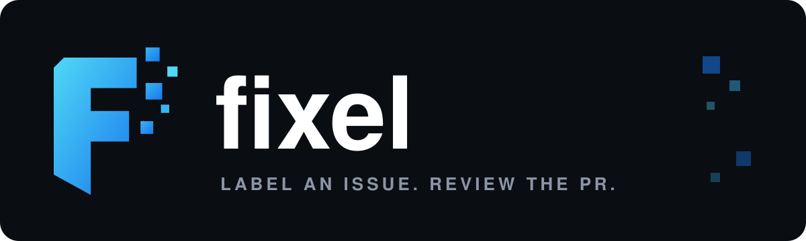
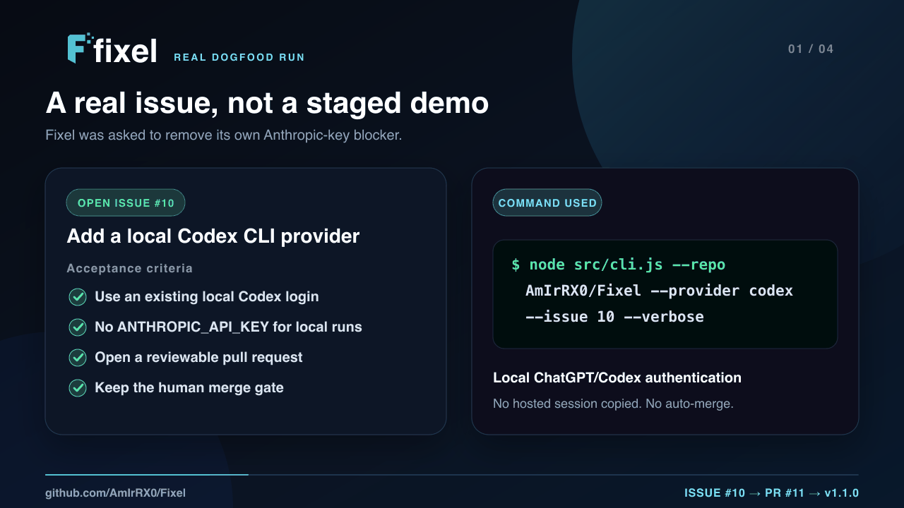
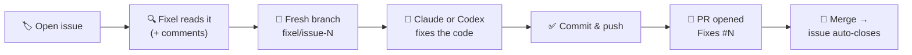

<div align="center">



**Label an issue. Get a reviewable pull request.**

*Fixel is an open-source GitHub Action and CLI that turns a labeled issue into a focused code change for you to review.*

[](LICENSE)
[](https://github.com/AmIrRX0/Fixel/actions/workflows/ci.yml)
[](https://nodejs.org)
[](https://claude.com)
[](https://developers.openai.com/codex)
[](#-use-as-a-github-action)
[](CONTRIBUTING.md)

[English](#-english) · [فارسی](#-فارسی)

<a href="https://github.com/AmIrRX0/Fixel/pull/11">
  
</a>

<sub><b>Verified dogfood / اجرای واقعی:</b> <a href="https://github.com/AmIrRX0/Fixel/issues/10">issue #10</a> → <a href="https://github.com/AmIrRX0/Fixel/pull/11">Fixel + Codex PR #11</a> → security review → <a href="https://github.com/AmIrRX0/Fixel/releases/tag/v1.1.0">v1.1.0</a>. The first working implementation was not merged until its credential boundary passed an adversarial probe.</sub>

</div>

---

## 🇬🇧 English

Fixel is a human-gated GitHub issue-fixing agent. Point it at a repository and it uses either [Claude](https://claude.com) or a locally authenticated [Codex CLI](https://developers.openai.com/codex) to propose a focused pull request for each selected issue. If you cannot push to the repository, Fixel can work through your fork. **It never auto-merges: review the diff and CI before merging.**

### 🧠 Never Fail Twice

Turn a reviewed PR into a repository lesson:

```bash
fixel learn --repo myuser/myapp --pr 42
```

Fixel captures the PR description, review comments, inline feedback, conversation comments, and failed checks in `.fixel/lessons/pr-42.md`. The file starts as `status: draft`, so it has **no effect**. A maintainer must replace the placeholders with one specific rule and a regression command, review the captured evidence, and change it to `status: approved`. Future runs automatically load approved lessons; drafts and malformed or oversized files are ignored.

> Review → lesson draft → maintainer approval → future fix → regression command. See the [full workflow and threat model](docs/never-fail-twice.md).



### ⚡ Use as a GitHub Action

The zero-setup way. Copy [`examples/label-trigger.yml`](examples/label-trigger.yml) to `.github/workflows/fixel.yml` in your repo, add your `ANTHROPIC_API_KEY` secret, and then — **just add the `fixel` label to any issue.** A pull request shows up by itself:

```yaml
name: Fixel
on:
  issues:
    types: [labeled]

jobs:
  fix:
    if: github.event.label.name == 'fixel'
    runs-on: ubuntu-latest
    permissions:
      contents: write
      pull-requests: write
      issues: read
    steps:
      - uses: AmIrRX0/Fixel@v1.2.0
        with:
          anthropic-api-key: ${{ secrets.ANTHROPIC_API_KEY }}
          github-token: ${{ secrets.GITHUB_TOKEN }}
          issue-number: ${{ github.event.issue.number }}
```

Prefer a night shift? [`examples/nightly.yml`](examples/nightly.yml) makes Fixel fix up to 3 `bug`-labeled issues every night while you sleep. 😴

### 💻 Use as a CLI

Already signed in to Codex with ChatGPT? This local path does **not** need `ANTHROPIC_API_KEY`:

```bash
codex login
codex login status
export GITHUB_TOKEN="your-minimum-permission-github-token"

# Run the released CLI directly from GitHub — no clone or npm install
npx --yes github:AmIrRX0/Fixel#v1.2.0 --repo myuser/myapp --provider codex --issue 42 --verbose
```

Or clone it when you want the source locally:

```bash
export GITHUB_TOKEN="your-minimum-permission-github-token"

git clone https://github.com/AmIrRX0/Fixel.git
cd Fixel
npm install
node src/cli.js --repo myuser/myapp --provider codex --issue 42 --verbose
```

Fixel invokes `codex exec` non-interactively with ephemeral state and a granular permission profile: project roots are writable, common credential paths are denied, and shell network access is limited to required GitHub/package hosts. ChatGPT sign-in is for **local CLI runs**; the GitHub Action still uses Claude and an `ANTHROPIC_API_KEY` because your local Codex session must not be copied to a hosted runner.

Claude remains the backward-compatible default:

```bash
git clone https://github.com/AmIrRX0/Fixel.git
cd Fixel
npm install

cp .env.example .env   # put your tokens in it

# Your own repo: fix the first 3 open issues and open PRs
node --env-file=.env src/cli.js --repo myuser/myapp

# Someone else's repo: fork it, fix only issue #42, stream progress
node --env-file=.env src/cli.js --repo bigorg/oss-project --fork --issue 42 --verbose

# Try it safely first: fix locally and show the diff, no push, no PR
node --env-file=.env src/cli.js --repo myuser/myapp --dry-run
```

### ✨ What it does

1. Connects to GitHub with your `GITHUB_TOKEN`
2. If you don't have push access to the repo (or you pass `--fork`), it **forks** the repo and syncs the fork with upstream
3. Lists the open issues (filterable by label or issue number)
4. For each issue: fresh branch off the latest base (`fixel/issue-N`) → the selected provider fixes the code inside a clone → commit → push → **PR with `Fixes #N`** (so the issue closes automatically on merge)
5. Skips issues that already have an open PR — no duplicate work

### ⚙️ CLI options

| Option | Description |
|---|---|
| `--repo <owner/name>` | Target repository (required) |
| `-V, --version` | Show the Fixel CLI version |
| `--fork` | Fork the repo and open PRs from the fork (automatic when you lack push access) |
| `--issue <n>` | Only this issue (repeatable: `--issue 3 --issue 7`) |
| `--max-issues <n>` | Max issues per run (default: 3) |
| `--labels <a,b>` | Only issues carrying these labels |
| `--base <branch>` | Base branch for PRs (default: the repo's default branch) |
| `--provider <name>` | `claude` or `codex` (default: `claude`; also configurable with `FIXEL_PROVIDER`) |
| `--model <id>` | Provider-specific model id (default: provider default) |
| `--dry-run` | Fix locally and show the diff — no push, no PR |
| `--verbose` | Stream the agent's progress step by step |

Learning command options:

| Option | Description |
|---|---|
| `learn` | Capture PR feedback as an inert lesson draft |
| `--pr <n>` | Pull request to learn from (required with `learn`) |
| `--output <path>` | Draft path (default: `.fixel/lessons/pr-N.md`) |

### 📦 Requirements

- Node.js 20+ and `git`
- A [GitHub token](https://github.com/settings/tokens) — classic with the `repo` scope, or fine-grained with Contents (read/write) + Issues (read) + Pull requests (read/write). In fork mode, push access is only needed on **your fork**. (As an Action, `secrets.GITHUB_TOKEN` just works.)
- For `--provider codex`: the [Codex CLI](https://developers.openai.com/codex/cli) installed and authenticated with `codex login`; no Anthropic key is needed.
- For `--provider claude`: the [Claude Agent SDK sandbox prerequisites](https://platform.claude.com/docs/en/agent-sdk/overview) and an `ANTHROPIC_API_KEY` (or supported local Claude authentication). The Action installs missing Linux sandbox prerequisites automatically.

### 🔒 Security notes

- The GitHub token never appears in remote URLs or visible process arguments (a transient credential helper is used instead).
- The agent works inside a throwaway clone. Codex shell commands use a granular filesystem/network profile that explicitly denies common credential paths; GitHub, Anthropic, OpenAI, package, and unrelated host environment credentials are also excluded from the Codex process. The Claude provider independently denies common credential files and the Anthropic key to sandboxed commands.
- Codex issue text is sent through stdin, never interpolated into a shell command or exposed as a process argument. Codex runs ephemerally without loading user config or exec-policy rules.
- The agent is not allowed to commit or push by itself — Fixel performs those operations outside the agent session.
- Issue text, comments, repository code, and tests are untrusted input. Use an isolated runner and minimum-permission token, prefer `--fork` or `--dry-run` for unfamiliar repositories, and always review generated code before merging. See the full [security policy](SECURITY.md).

### 🗺️ Roadmap

- [x] CLI with fork mode, labels filter, dry-run
- [x] GitHub Action with label trigger + nightly schedule
- [ ] Comment trigger (`@fixel fix this`) on issues
- [ ] Auto-retry when CI fails on the opened PR
- [ ] Cost report comment on each PR
- [x] Human-approved learning from review and CI evidence (`fixel learn`)

### 🧠 Architecture

```
action.yml      ← GitHub Action wrapper (label an issue → get a PR)
src/cli.js      ← argument parsing & input validation
src/runner.js   ← orchestration: fork/clone → pick issues → branch → agent → commit → push → PR
src/agent.js    ← Claude Agent SDK provider
src/codex-agent.js ← local Codex CLI provider
src/prompt.js   ← shared untrusted-issue prompt boundary
src/learning.js ← PR/review/check evidence → inert lesson draft
src/lessons.js  ← bounded loader for maintainer-approved repository lessons
src/github.js   ← GitHub API via Octokit (issues, forks, PRs)
src/git.js      ← git operations with safe authentication
src/config.js   ← env loading
```

> ⭐ **If Fixel saved you a debugging night, star the repo** — it's how other developers find it.

---

## 🇮🇷 فارسی

<div dir="rtl">

Fixel یک ایجنت حل ایشوهای گیت‌هاب با کنترل انسانی است. یک ریپو به آن بده؛ ایشوهای انتخاب‌شده را می‌خواند و با Claude یا Codex CLI یک Pull Request پیشنهادی می‌سازد. اگر دسترسی push نداشته باشی، از فورک استفاده می‌کند. <b>Fixel هیچ PRی را خودکار مرج نمی‌کند؛ diff و CI را قبل از مرج بررسی کن.</b>

### 🧠 یک اشتباه را دوبار تکرار نکن

با فرمان زیر بازخورد یک PR را به lesson تبدیل کن:

```bash
fixel learn --repo myuser/myapp --pr 42
```

فایل ساخته‌شده ابتدا `status: draft` دارد و هیچ اثری روی ایجنت نمی‌گذارد. maintainer باید قانون دقیق و فرمان regression را بنویسد، evidence را بررسی کند و سپس وضعیت را به `approved` تغییر دهد. فقط lessonهای تأییدشده در اجراهای بعدی خوانده می‌شوند. جزئیات در [راهنمای Never Fail Twice](docs/never-fail-twice.md) آمده است.

### ⚡ استفاده به‌عنوان GitHub Action

راحت‌ترین راه، بدون هیچ سروری: فایل <a href="examples/label-trigger.yml"><code>examples/label-trigger.yml</code></a> را در ریپوی خودت در مسیر <code>.github/workflows/fixel.yml</code> کپی کن، سیکرت <code>ANTHROPIC_API_KEY</code> را اضافه کن و بعد — <b>فقط روی هر ایشویی لیبل <code>fixel</code> بزن.</b> پول‌ریکوئست خودش ظاهر می‌شود! برای اجرای شبانه هم <a href="examples/nightly.yml"><code>examples/nightly.yml</code></a> را بردار: هر شب تا ۳ ایشوی دارای لیبل <code>bug</code> را وقتی خوابی فیکس می‌کند 😴

### 💻 استفاده به‌عنوان CLI

</div>

اگر Codex با حساب ChatGPT روی سیستم لاگین است، به `ANTHROPIC_API_KEY` نیاز نداری:

```bash
codex login
codex login status
export GITHUB_TOKEN="github-token-with-minimum-permissions"

git clone https://github.com/AmIrRX0/Fixel.git
cd Fixel
npm install
node src/cli.js --repo myuser/myapp --provider codex --issue 42 --verbose
```

این روش مخصوص اجرای لوکال است. GitHub Action همچنان از Claude و `ANTHROPIC_API_KEY` استفاده می‌کند، چون نشست شخصی Codex نباید به runner عمومی منتقل شود.

برای provider پیش‌فرض Claude:

```bash
git clone https://github.com/AmIrRX0/Fixel.git
cd Fixel
npm install

cp .env.example .env   # توکن‌ها رو داخلش بذار

# روی ریپوی خودت: ۳ تا ایشوی باز اول رو حل کن و PR بزن
node --env-file=.env src/cli.js --repo myuser/myapp

# روی ریپوی بقیه: فورک بزن، فقط ایشوی ۴۲ رو حل کن، پیشرفت رو هم نشون بده
node --env-file=.env src/cli.js --repo bigorg/oss-project --fork --issue 42 --verbose

# اول فقط تست کن ببین چه تغییری می‌ده، بدون پوش و PR
node --env-file=.env src/cli.js --repo myuser/myapp --dry-run
```

<div dir="rtl">

### ✨ چی کار می‌کنه؟

<ol>
<li>با <code>GITHUB_TOKEN</code> به گیت‌هاب وصل می‌شه</li>
<li>اگر به ریپو دسترسی push نداشته باشی (یا <code>--fork</code> بدی) خودش <b>فورک</b> می‌زنه و فورک رو با upstream سینک می‌کنه</li>
<li>ایشوهای باز رو لیست می‌کنه (با قابلیت فیلتر با لیبل یا شماره ایشو)</li>
<li>برای هر ایشو: برنچ تازه از آخرین کد base (<code>fixel/issue-N</code>) ← فیکس توسط provider انتخاب‌شده داخل کلونِ ریپو ← کامیت ← پوش ← <b>PR با <code>Fixes #N</code></b> (تا با مرج، ایشو خودکار بسته بشه)</li>
<li>اگر برای ایشویی از قبل PR باز وجود داشته باشه، دوباره‌کاری نمی‌کنه</li>
</ol>

### ⚙️ آپشن‌های CLI

| آپشن | توضیح |
|---|---|
| <code>--repo &lt;owner/name&gt;</code> | ریپوی هدف (اجباری) |
| <code>-V, --version</code> | نمایش نسخه CLI فیکسل |
| <code>--fork</code> | فورک بزن و PR رو از فورک باز کن (اگر دسترسی push نداشته باشی خودکار فعال می‌شه) |
| <code>--issue &lt;n&gt;</code> | فقط این ایشو (قابل تکرار: <code>--issue 3 --issue 7</code>) |
| <code>--max-issues &lt;n&gt;</code> | حداکثر تعداد ایشو در هر اجرا (پیش‌فرض: ۳) |
| <code>--labels &lt;a,b&gt;</code> | فقط ایشوهایی که این لیبل‌ها رو دارن |
| <code>--base &lt;branch&gt;</code> | برنچ مقصد PRها (پیش‌فرض: برنچ اصلی ریپو) |
| <code>--provider &lt;name&gt;</code> | انتخاب <code>claude</code> یا <code>codex</code> (پیش‌فرض: <code>claude</code>) |
| <code>--model &lt;id&gt;</code> | شناسه مدل مخصوص provider (پیش‌فرض: مدل پیش‌فرض همان provider) |
| <code>--dry-run</code> | فقط فیکس لوکال و نمایش diff — بدون پوش و PR |
| <code>--verbose</code> | نمایش قدم‌به‌قدم کار ایجنت |

### 📦 پیش‌نیازها

<ul>
<li>Node.js نسخه ۲۰ به بالا و <code>git</code></li>
<li>یک <a href="https://github.com/settings/tokens">GitHub token</a> — کلاسیک با اسکوپ <code>repo</code>، یا fine-grained با دسترسی Contents (خواندن/نوشتن) + Issues (خواندن) + Pull requests (خواندن/نوشتن). در حالت فورک، فقط روی فورکِ خودت دسترسی push لازمه. (در حالت Action همون <code>secrets.GITHUB_TOKEN</code> کافیه.)</li>
<li>برای <code>--provider codex</code>: نصب Codex CLI و ورود با <code>codex login</code>؛ کلید Anthropic لازم نیست.</li>
<li>برای <code>--provider claude</code>: پیش‌نیازهای sandbox مربوط به Claude Agent SDK و <code>ANTHROPIC_API_KEY</code> یا احراز هویت پشتیبانی‌شده Claude.</li>
</ul>

### 🔒 نکات امنیتی

<ul>
<li>توکن گیت‌هاب هیچ‌وقت داخل URL ریموت یا آرگومان‌های قابل‌مشاهده قرار نمی‌گیره (از credential helper موقتی استفاده می‌شه).</li>
<li>فرمان‌های ایجنت داخل sandbox اجرا می‌شوند؛ توکن GitHub و کلیدهای API یا package وارد محیط Codex نمی‌شوند. متن ایشو نیز از stdin فرستاده می‌شود و داخل فرمان shell قرار نمی‌گیرد.</li>
<li>ایجنت اجازه‌ی commit/push مستقیم ندارد — این کارها را Fixel بیرون از session ایجنت انجام می‌دهد.</li>
<li>متن ایشو، کامنت‌ها، کد ریپو و تست‌ها ورودی غیرقابل‌اعتماد هستند. روی runner ایزوله و با حداقل دسترسی اجرا کن، برای ریپوهای غریبه از <code>--fork</code> یا <code>--dry-run</code> استفاده کن و PR را همیشه قبل از مرج بازبینی کن. جزئیات در <a href="SECURITY.md">سیاست امنیتی</a> آمده است.</li>
</ul>

### 🗺️ نقشه راه

<ul>
<li>✅ CLI با حالت فورک، فیلتر لیبل و dry-run</li>
<li>✅ GitHub Action با تریگر لیبل + زمان‌بندی شبانه</li>
<li>⬜ تریگر با کامنت (<code>@fixel fix this</code>) روی ایشوها</li>
<li>⬜ تلاش مجدد خودکار وقتی CI روی PR قرمز می‌شه</li>
<li>⬜ کامنت گزارش هزینه روی هر PR</li>
<li>✅ یادگیری با تأیید انسان از review و CI با <code>fixel learn</code></li>
</ul>

<blockquote>⭐ اگه Fixel یک شب دیباگ رو برات نجات داد، به ریپو استار بده — بقیه‌ی دولوپرها این‌طوری پیداش می‌کنن.</blockquote>

</div>

---

<div align="center">

🔧 *Fixel — label an issue, get a reviewable pull request.*

</div>
